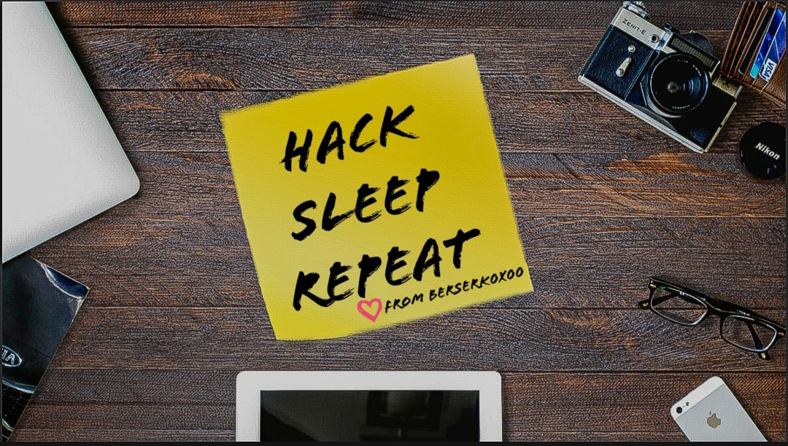

# OpenSource Lover 

- This one was "hard", i managed to solve the second one before the first one and didnt manage to solve the first one so here goes

- We have this image 

- Looking at it you can see `berserk0x00`, looking that up on the search engines won't get you much 

- So instead go to the social media websites with something like this `https://instagram.com/USERNAME`, this gets us the profile we need which is 

`https://instagram.com/berserk0x00` 

- Looking around, we can see a post with `0xguts` and he is an opensource lover, put 2 together and go to github with the same technique 

`https://github.com/0xguts`

- Again look around on his profile we can see `underworld`, which has `10 commits`, look through them and we are able to find the email 

`guts.berserk@gmail.com`

- Google `public key server` and we get this `https://keyserver.ubuntu.com`

- Enter in the email and we get the flag along with his pgp key 

# Flag - wormcon{Y0u_kn0w_th3_s4uc3_w1d31r1}